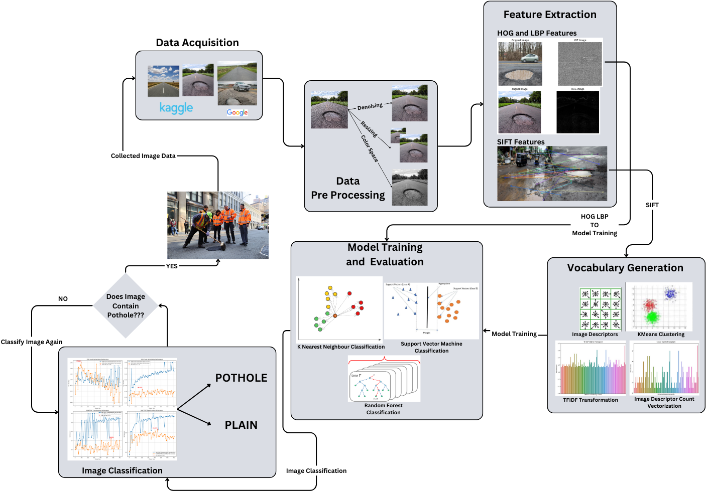
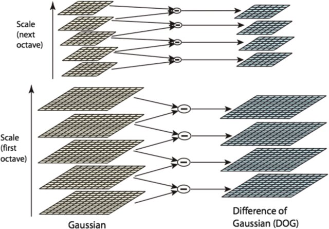
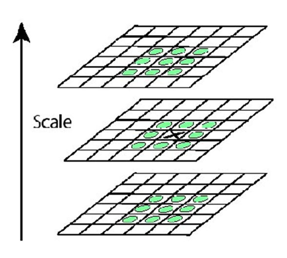
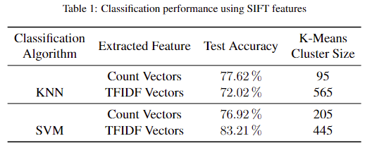
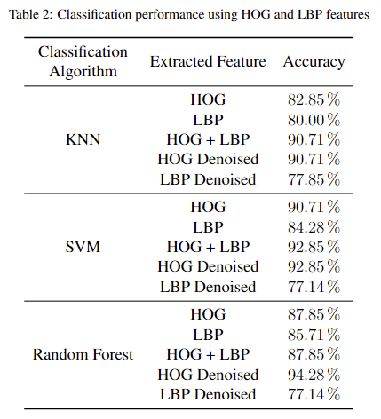
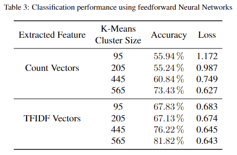

# Road Pothole Detection using Supervised and Unsupervised Methods

## 📌 Overview

This repository contains the implementation of our **Road Pothole Detection** framework using **Scale Invariant Feature Transform (SIFT), Bag of Visual Words (BoVW), Histogram of Oriented Gradients (HOG), and Local Binary Patterns (LBP).** The project explores machine learning models like **KNN, SVM, Random Forest, and Feedforward Neural Networks (FFNN)** for pothole classification.

## 📷 System Overview

**Figure 1: Systematic flowchart for road pothole detection**

## 📜 Methodology

### 🔹 Feature Extraction Techniques

1. **SIFT (Scale Invariant Feature Transform) + Bag of Visual Words**

    - Extracts keypoints and descriptors from road images.
    - Clusters features using **K-Means** and transforms them with **TF-IDF weighting**.

2. **HOG + LBP (Texture-Based Features)**
    - HOG captures **gradient-based features**, while LBP detects **texture patterns**.
    - Features can be used individually or concatenated.

**Figure 2: Difference of Gaussian for SIFT keypoint detection**

**Figure 3: Keypoint detection using 26-neighbor pixel analysis**

### 🔹 Machine Learning Models Used

-   **K-Nearest Neighbors (KNN)**
-   **Support Vector Machines (SVM)**
-   **Random Forest Classifier (RF)**
-   **Feedforward Neural Networks (FFNN)**

## 📊 Results & Comparisons

### 🔹 Dataset

-   The dataset contains **350+ pothole and plain road images**.
-   Images are resized to **256×256 grayscale format** for uniform processing.

**Figure 4: Sample images from the dataset**

### 🔹 Classification Performance

| Algorithm | Feature Used         | Best Accuracy |
| --------- | -------------------- | ------------- |
| **KNN**   | SIFT + BoVW          | 77.62%        |
| **SVM**   | SIFT + BoVW (TF-IDF) | 83.21%        |
| **SVM**   | HOG + LBP            | 92.85%        |
| **RF**    | HOG + LBP (Denoised) | 94.28%        |

**Figure 5: Model performance comparison**

## 🛠 Installation & Setup

### 🔹 Prerequisites

-   Python 3.x
-   OpenCV, Scikit-learn, NumPy, Matplotlib
-   TensorFlow (for FFNN model)
